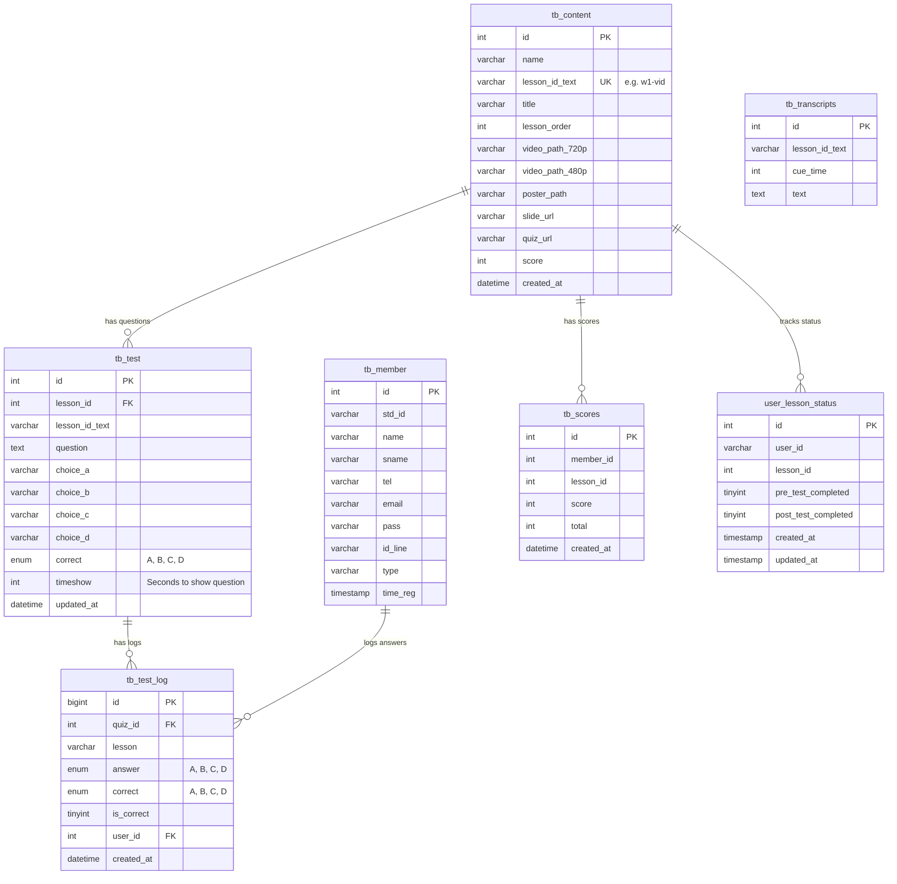

# Database Diagram

This document outlines the current database schema for the application.

## Entity Relationship Diagram (ERD)

## Table Descriptions

### 1. `tb_member`
Stores user/student information.
- **Primary Key**: `id`
- **Key Columns**: `std_id` (Student ID), `email`, `pass` (Password).

### 2. `tb_content`
Stores metadata for lessons/videos.
- **Primary Key**: `id`
- **Unique Key**: `lesson_id_text` (String identifier for the lesson, e.g., 'w1-vid').
- **Columns**: Stores paths to video files (720p, 480p), poster images, and external URLs for slides/quizzes.

### 3. `tb_test`
Stores the questions associated with each lesson.
- **Primary Key**: `id`
- **Foreign Key**: `lesson_id` (Links to `tb_content.id`).
- **Columns**: Contains the question text, 4 choices (A-D), the correct answer, and `timeshow` (when to show the question in the video).

### 4. `tb_test_log`
Logs every answer attempt by a user for a specific question.
- **Primary Key**: `id`
- **Foreign Keys**: 
    - `quiz_id` (Links to `tb_test.id`)
    - `user_id` (Links to `tb_member.id`)
- **Columns**: Records the user's answer, whether it was correct, and the timestamp.

### 5. `tb_transcripts`
Stores subtitles or transcripts for the video lessons.
- **Primary Key**: `id`
- **Columns**: `lesson_id_text` (links to lesson), `cue_time` (timestamp in seconds), and the transcript `text`.

### 6. `tb_scores`
Stores the aggregate score for a student on a specific lesson.
- **Primary Key**: `id`
- **Columns**: `member_id` (links to `tb_member.id`), `lesson_id`, `score`, and `total` possible score.

### 7. `user_lesson_status`
Tracks whether a user has completed the pre-test and post-test for a lesson.
- **Primary Key**: `id`
- **Columns**: `user_id`, `lesson_id`, and boolean flags for completion status.
